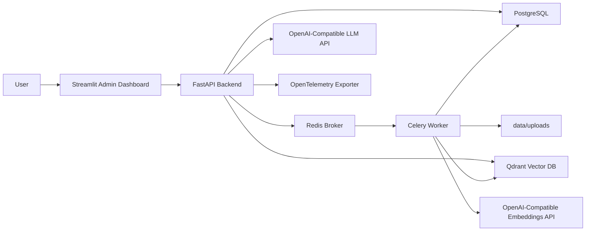

# Enterprise Knowledge RAG Platform

Production-oriented MVP for a multi-tenant internal knowledge-base RAG system. It includes JWT authentication, workspace-level RBAC, asynchronous document ingestion, Qdrant retrieval, citation-grounded answers, audit logs, feedback, evaluation, Docker Compose, and pytest coverage.

## Architecture



## Features

- Users register and log in with JWT access tokens.
- Workspaces isolate documents, queries, audit logs, feedback, and evaluation data.
- RBAC roles are enforced per workspace: `admin`, `manager`, `viewer`.
- Upload supports `PDF`, `TXT`, `MD`, and `DOCX`.
- Celery extracts text, chunks it with metadata, embeds it, and stores vectors in Qdrant.
- `/query` retrieves workspace-scoped chunks, generates an answer, returns citations, and logs an audit record.
- If retrieval confidence is too low, the API refuses instead of fabricating an answer.
- Streamlit dashboard covers login, workspaces, upload, questions, history, feedback, and evaluations.
- Evaluation supports golden QA pairs and batch metrics.

## Quick Start

1. Create environment file:

```bash
cp .env.example .env
```

2. Start the stack:

```bash
docker compose up --build
```

3. Open:

- API: http://localhost:8000/docs
- Frontend: http://localhost:8501
- Qdrant: http://localhost:6333/dashboard

The default `.env.example` uses deterministic local embeddings and local answer generation so the stack runs without an external model server. For production use, configure `LLM_PROVIDER=openai-compatible` and `EMBEDDING_PROVIDER=openai-compatible`.

## Model Configuration

OpenAI:

```env
LLM_PROVIDER=openai-compatible
LLM_BASE_URL=https://api.openai.com/v1
LLM_API_KEY=sk-...
LLM_MODEL=gpt-4o-mini
EMBEDDING_PROVIDER=openai-compatible
EMBEDDING_BASE_URL=https://api.openai.com/v1
EMBEDDING_API_KEY=sk-...
EMBEDDING_MODEL=text-embedding-3-small
EMBEDDING_DIMENSION=1536
```

LM Studio or Ollama with OpenAI-compatible endpoints:

```env
LLM_PROVIDER=openai-compatible
LLM_BASE_URL=http://host.docker.internal:1234/v1
LLM_MODEL=local-model
EMBEDDING_PROVIDER=openai-compatible
EMBEDDING_BASE_URL=http://host.docker.internal:11434/v1
EMBEDDING_MODEL=nomic-embed-text
```

If you change `EMBEDDING_DIMENSION`, recreate the Qdrant collection or use a new `QDRANT_COLLECTION`.

## API Examples

Register and login:

```bash
curl -X POST http://localhost:8000/auth/register \
  -H "Content-Type: application/json" \
  -d '{"email":"admin@example.com","password":"Password123!","full_name":"Admin"}'

TOKEN=$(curl -s -X POST http://localhost:8000/auth/login \
  -H "Content-Type: application/json" \
  -d '{"email":"admin@example.com","password":"Password123!"}' | jq -r .access_token)
```

Create workspace:

```bash
curl -X POST http://localhost:8000/workspaces \
  -H "Authorization: Bearer $TOKEN" \
  -H "Content-Type: application/json" \
  -d '{"name":"Security Knowledge Base","description":"Policies and procedures"}'
```

Upload document:

```bash
curl -X POST http://localhost:8000/documents/upload \
  -H "Authorization: Bearer $TOKEN" \
  -F workspace_id="<workspace-id>" \
  -F file=@docs/sample-policy.md
```

Ask a question:

```bash
curl -X POST http://localhost:8000/query \
  -H "Authorization: Bearer $TOKEN" \
  -H "Content-Type: application/json" \
  -d '{"workspace_id":"<workspace-id>","question":"What is the access review cadence?","top_k":5}'
```

Run evaluation:

```bash
python -m backend.app.rag.evaluate run --workspace-id <workspace-id> --user-email admin@example.com
```

## Demo Script

1. Register `admin@example.com` in the Streamlit app.
2. Create a workspace named `Security Knowledge Base`.
3. Upload a small policy document in `TXT`, `MD`, `PDF`, or `DOCX` format.
4. Wait for document status to move from `pending` to `completed`.
5. Ask a question whose answer appears in the document.
6. Open citations and verify snippets match the answer.
7. Mark the answer `helpful`, `wrong`, or `unsafe`.
8. Add a golden QA pair in the Evaluation tab.
9. Run evaluation and inspect metrics.
10. Review the query in Query History.

## Local Development

Install dependencies:

```bash
python -m venv .venv
. .venv/Scripts/activate
pip install -r requirements.txt
```

Run tests:

```bash
pytest
```

Run API without Docker dependencies for lightweight development:

```bash
$env:DATABASE_URL="sqlite:///./local.db"
$env:VECTOR_STORE="memory"
$env:AUTO_CREATE_TABLES="true"
$env:OTEL_ENABLED="false"
uvicorn backend.app.main:app --reload
```

Run Streamlit:

```bash
$env:BACKEND_URL="http://localhost:8000"
streamlit run frontend/app.py
```

## Known Limitations

- Local embedding and answer generation are deterministic development fallbacks, not a production model path.
- Raw files are stored on local disk under `data/uploads`; production should use object storage with encryption and retention policies.
- The first migration is hand-written for the current schema. Future changes should be generated and reviewed with Alembic.
- Document parsing is intentionally conservative; scanned PDFs need OCR integration.
- Audit and feedback views are workspace-admin scoped but do not yet include global compliance exports.

## Future Improvements

- Add refresh tokens, SSO/SAML/OIDC, and SCIM user provisioning.
- Add per-document ACLs in addition to workspace-level RBAC.
- Add object storage support for S3, Azure Blob, or GCS.
- Add OCR and table extraction.
- Add reranking and query rewriting.
- Add background evaluation scheduling and regression alerts.
- Add OpenTelemetry Collector, dashboards, and trace sampling configuration.

